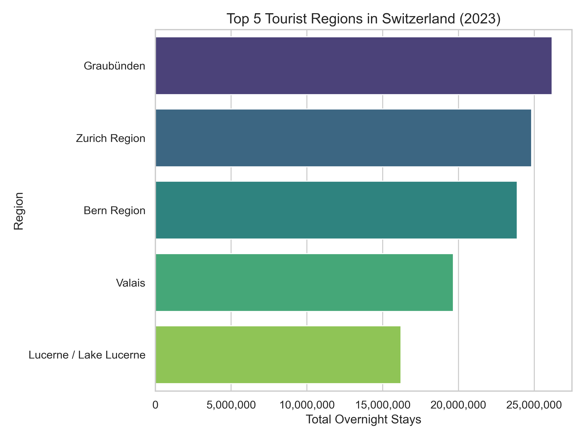

# 🇨🇭 Swiss Tourism Trend Analysis (2019–2023)

A data-driven analysis of tourism trends across Swiss regions from 2019 to 2023, built to uncover post-COVID recovery, Swiss vs foreign tourist shifts, and regional growth.

> Tools Used: **Python, Pandas, Matplotlib, Seaborn**  
> Skills: **Data Cleaning, Reshaping, EDA, Visual Storytelling**  
> Target: **Showcase skills for Swiss data analyst roles**

---

## Dataset

Source: [Swiss Federal Statistical Office – HESTA Hotel Accommodation Statistics](https://www.bfs.admin.ch/bfs/en/home/statistics/tourism.html)  
Cleaned from multi-sheet Excel files and reshaped to long format for analysis.

| Year | Region | Swiss | Foreigners | Total |
|------|--------|--------|------------|-------|
| 2019 | Zurich | 2.1M | 4.3M | 6.5M |
| ...  | ...    | ...  | ...  | ...  |

---

## Data Cleaning Summary

- Extracted from Excel sheet `T2.2.6`, skipping first 4 note rows.
- Removed footers, blank rows, and summary rows like "Total Switzerland".
- Reshaped from wide format (2019–2023) to long format using `pd.concat()`.
- Converted values to numeric, removed commas.
- Final dataset saved as: `cleaned_tourism_data_2019-2023.csv`

---

## Visual Insights

### 1. Total Tourism Trend (2019–2023)
Shows the dramatic dip during COVID (2020–21) and the recovery in 2022–23.

---

### 2. Region-wise Contribution
Stacked bar shows how each region contributes to national tourism.

---

### 3. Swiss vs Foreign Tourists by Year
Swiss citizens supported local tourism during lockdown years.

---

### 4. Top 5 Regions in 2023
Zurich, Bern, and Lucerne are the tourism powerhouses post-COVID.

---

### 5. Zurich vs Geneva vs Bern Trendline
Key economic hubs — Zurich had the most resilient and growing tourism.

---

## ✨ Key Findings

- **Zurich Region** leads tourism recovery in 2023.
- **Swiss tourists** dominated during COVID, while **foreign visitors** sharply dropped.
- **Lucerne and Valais** remain steady performers across years.
- Geneva still hasn’t reached pre-COVID foreign visitor levels.

---

## ✅ What I Learned

- How to clean messy Excel tourism datasets
- How to reshape wide time-series data for trend analysis
- How to visualize insights using `matplotlib` and `seaborn`
- How to tell stories that matter to Swiss data-driven decision-makers

---

## 📌 About Me

I'm a **Computer Science graduate from India**, aspiring to become a **Data Analyst in Switzerland**.  
This project is part of my **Data Analyst Swiss Recruiter Magnet Series** 🚀

**Let’s connect!**  
- [LinkedIn](https://www.linkedin.com/in/vijaivarmadataanalyst)

